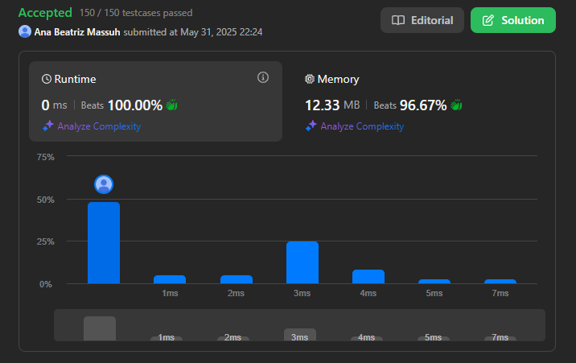
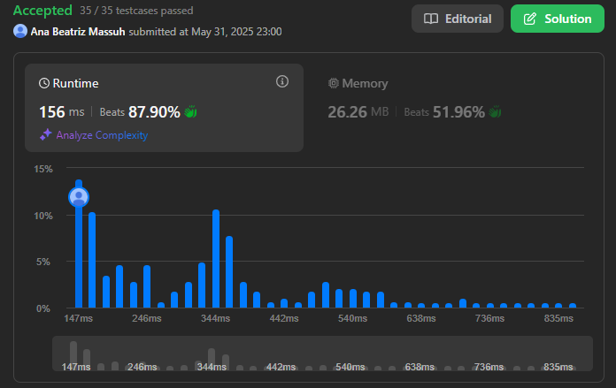
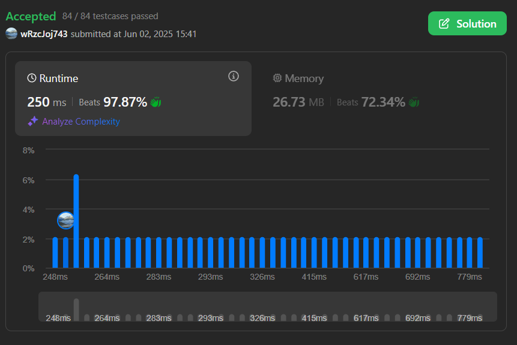

# 📘 Lista 3 - Greed

**Número da Lista**: 3<br>
**Conteúdo da Disciplina**: Greed<br>

## 👨‍💻 Alunos

| Matrícula   | Aluno                        |
| ----------- | ---------------------------- |
| 20/0060783  | Ana Beatriz W. Massuh        |
| 21/1063194  | Lucas Victor F. de Araújo    |


## 📌 Sobre

Este repositório contém as soluções desenvolvidas para a Lista 2 da disciplina de Algoritmos Ambiciosos.

As atividades abordam problemas clássicos de otimização e tomada de decisão, com foco em eficiência algorítmica, clareza e aplicabilidade prática.

### 🧠 Conteúdo Abordado
#### Problemas de agendamento e otimização:

* Interval Scheduling (Agendamento de Intervalos Máximo)

* Interval Partitioning (Particionamento de Intervalos)

* Scheduling to Minimize Lateness (Agendamento para Minimizar Atrasos)

#### Problemas de seleção e empacotamento:

* Knapsack Problem (Problema da Mochila)

* Algoritmo do Trocador (Coin Change)

* Algoritmo do Caminhoneiro (Truck Driver Problem)

* Compressão e codificação:

* Huffman Codes (Codificação de Huffman)

## 🖼️ Screenshots

### Questão 1


### Questão 2


### Questão 3


### Questão 4


## ⚙️ Instalação

**Linguagem utilizada**: Python  
**Bibliotecas necessárias**: Nenhuma biblioteca externa além da padrão.

## 💡 Como Executar

1. Clone este repositório:
   ```bash
   git clone https://github.com/projeto-de-algoritmos-2025/Greed_Questoes.git
   ```

2. Navegue até o diretório do projeto:
    ``` bash
    cd Grafos_2
    ```

3. Execute os scripts em Python com:
   ```bash
   python3 nome_do_arquivo.py
   ```

## Questões:

<div align="center">

| Questão           | Solução                 | Dificuldade             |
| ------------------| ----------------------- | ----------------------- |
| [Questão 1](https://github.com/projeto-de-algoritmos-2025/Greed_Questoes/blob/main/Questões/Questão1.md)| [Solução 1](https://github.com/projeto-de-algoritmos-2025/Greed_Questoes/blob/main/Soluções/Solucao1.py)| Difícil |
| [Questão 2](https://github.com/projeto-de-algoritmos-2025/Greed_Questoes/blob/main/Questões/Questão2.md)| [Solução 2](https://github.com/projeto-de-algoritmos-2025/Greed_Questoes/blob/main/Soluções/Solucao2.py)| Difícil |
| [Questão 3](https://github.com/projeto-de-algoritmos-2025/Greed_Questoes/blob/main/Questões/Questão3.md)| [Solução 3](https://github.com/projeto-de-algoritmos-2025/Greed_Questoes/blob/main/Soluções/Solucao3.py)| Medium |
| [Questão 4](https://github.com/projeto-de-algoritmos-2025/Greed_Questoes/blob/main/Questões/Questão4.md)| [Solução 4](https://github.com/projeto-de-algoritmos-2025/Greed_Questoes/blob/main/Soluções/Solucao4.py)| Medium |

